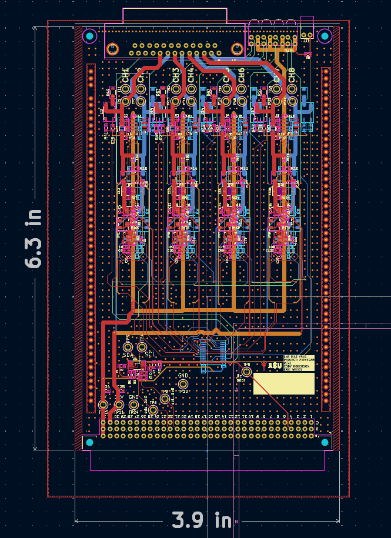

# Hardware Documentation

The Bias Boards were designed using KiCAD 9.0.2. The project [can be found on github](https://github.com/asu-rdl/Primecam-Bias/tree/main/board).

[Here is a link to the schematics in PDF form](./primecamLNABiasPotVreg.pdf)

And this is a screenshot of the layout as well as pdf links to the layout. Viewing the layout on KiCAD is the best choice.

## Here are PDF's of the layout:

[Front Copper](./primecamLNABiasPotVreg-F_Cu.pdf)

[Inner Layer 1 Copper](./primecamLNABiasPotVreg-In1_Cu.pdf)

[Inner Layer 1 Copper](./primecamLNABiasPotVreg-In2_Cu.pdf)

[Back Copper](./primecamLNABiasPotVreg-B_Cu.pdf)
