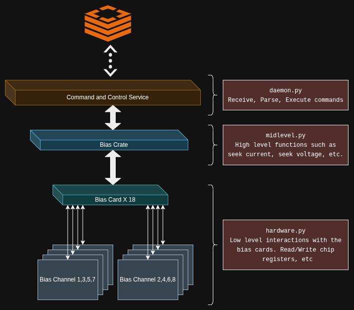

# Software Documentation


1. [Considerations](#Considerations) 
1. [Design](#Design)
    1. [Structure](#Structure)
    1. [Status](#Status)
    1. [Commanding](#Commanding)
        1. [Seek Voltage](#CommandSeekVoltage)
        1. [Seek Current](#CommandSeekCurrent)
        1. [Get Status](#CommandGetStatus)
        1. [Enable Output](#CommandEnableOutput)
        1. [Disable Output](#CommandDisableOutput)
    1. [Configuration](#Configuration)
    1. [Logs](#Logs)

<a name="Considerations"></a>
# Considerations 

- The software is called Sparky(ASU's mascot) Bias Daemon or sparkybiasd 
- The code should be easy for others to modify and use.
- The software shall run as a "Hands Off" daemon on the PI at startup; managed by [systemd](https://manpages.org/systemd).
    - An assumption was made that redis was being used to handle the readout system.
      Therefore, it would be reasonable to use that for bias control.
        - Implemented redis based control. User can set what the system subscribes to in the config file.
    - Using a raw socket is probably another option...
- The software shall generate a log file when running as a system service.
- The software should be easy for the end user to update. 
    - We will generate a python package so it can be installed and updated with pip.

-  A tool called [poetry](https://python-poetry.org/docs/) is used for package dependency management and package generation.


<a name="Design"></a>
# Design
---
<a name="Structure"></a>
## Structure
The software was written in layers. The lowest being the python class `BiasCard` within `hardware.py`.




<a name="Commanding"></a>
## Commanding
Commands are communicated as json strings passed around via Redis. Below are the available commands
and an example of their expected format. 

<a name="CommandSeekVoltage"></a>
### Command - Seek Voltage.
Seeks a voltage for a given card, channel. An acceptable range is between 0 and TBD.
You should expect to see vbus at or around the desired setting.
```json
{
    "command": "seekVoltage",
    "args": {
        "card": 1,
        "channel": 1,
        "voltage": 2.33
    }
}
```

<a name="CommandSeekCurrent"></a>
### Command - Seek Current.
Seeks a current for a given card, channel. An acceptable range is between 0 and TBD.
You should see that current is at or around the desired setting.
```json
{
    "command": "seekCurrent",
    "args": {
        "card": 1,
        "channel": 1,
        "current": 0.2
    }
}
```

<a name="CommandGetStatus"></a>
### Command - Get Status
Get the status of a specified card


```json
{
    "command": "getStatus",
    "args": {
        "card": 1,
        "channel": 1,
    }
}
```

<a name="CommandEnableOutput"></a>
### Command - Enable Output 
Enable a card's output

```json
{
    "command": "enableOutput",
    "args": {
        "card": 1,
        "channel": 1,
    }
}
```

<a name="CommandDisableOutput"></a>
### Command - Disable Output 
Disables a card's output

```json
{
    "command": "disableOutput",
    "args": {
        "card": 1,
        "channel": 1,
    }
}
```


## Reply On Command Success
```json
{
    "status": "ok",
    "card": 1,
    "channel": 1,
    "vbus": 2.334,
    "vshunt": 0.024,
    "current": 0.2,
    "outputEnabled": true,
    "wiper": 768
}
```


## Reply on Error
```json
{
    "status": "error",
    "code": -1,
    "msg": "Received an invalid command message"
}
```

<a name="Configuration"></a>
## Configuration
Configuration can be found in `/home/asu/daemon/config.yml`

<a name="Logs"></a>
## Logs
The application creates logs in `/home/asu/daemon/logs/applog.txt`. Logs can reach a maximum of 4 Megabytes before being rolled over.
The previous logs would be renamed to applog.txt.1, applog.txt.2, etc until 5. This is to keep the logs from being burdensome on the
system.

For details on implementation, see [Python's RotatingFileHandler](https://docs.python.org/3/library/logging.handlers.html#logging.handlers.RotatingFileHandler)


<!-- ## Document Generation -->
<!-- The documentation you are currently reading was generated automatically using github pages. An orphaned branch was  -->
<!-- created called `docs`. Changes in the main branch are pulled into docs manually, and on `git commit, git push` the docs are rebuilt and deployed. -->
<!---->
